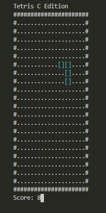
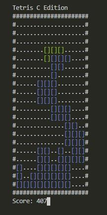
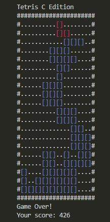

# Tetris.c

## Spis treści

- [1. Założenia projektowe](#założenia-projektowe)
- [2. Opis programu](#opis-programu)
- [3. Działanie programu](#działanie-programu)
  - [3.1 Konfiguracja](#1-konfiguracja)
  - [3.2 Moduły](#2-moduły)
  - [3.3 Zmienne globalne](#3-najważniejsze-zmienne-czyli-zmienne-globalne)
  - [3.4 Funkcje w programie](#4-funkcje-w-programie-czyli-plik-główny)
  - [3.5 Game Loop](#5-game-loop)
- [4. Kompilacja i uruchamianie](#kompilacja-i-uruchamienie)

## Założenia projektowe

Stworzenie grywalnej odsłony kultowej gry "tetris" w języku programowania C, z wykorzystaniem wiedzy nabytej na wykładach i laboratoriach przedmiotu Wprowadzenie do Informatyki. Wykorzystanie tylko wbudowanych w system bibliotek. Skorzystanie z konwencji nazewnictwa typu CamelCase (z wyłączeniem typów charakterystycznych dla języka C, czyli stałych oraz enumeracji).

## Opis programu

Przygotowaną przeze mnie aplikacja jest grą o nazwie "Tetris C Edition". Jej środowiskiem uruchomieniowym jest konsola systemu windows lub jej dowolny emulator.

| _Rys 1. Element_ | _Rys 2. Rozgrywka_ | _Rys 3. Koniec gry_ |
| --- | --- | --- |

Gra polega na ustawianiu kolejnych elementów o losowych kształtach tak, aby wypełnić poziomo linie i tym samym przedłużyć rozgrywkę (poziomo wypełniona linia, która została w całości wypełniona elementami usuwa się, tym samym powodując przesunięcie wszystkich innych wierszy nad nią do dołu). Jeśli element który sterujemy _(Rys.1)_ napotka przeszkodą podczas poruszania się do dołu zmieni kolor na niebieski i zostanie unieruchomiony _(Rys.2)_, a gracz przejmie kontrolę nad nowo wygenerowanym elementem. W przypadku, gdy obiekt nie znajdzie się on w całości okienka gry z powodu braku miejsca, nastąpi koniec gry _(Rys.3)_.

Gracz może sterować elementami przesuwając je w prawo lub lewo za pomocą strzałek (lewo, prawo) lub przycisków "a" oraz "d" na klawiaturze. Możemy również obracać elementem za pomocą strzałek (góra, dół) lub przycisków "w" oraz "S" odpowiednio o 270 stopni i 90 stopni.

Gracz zdobywa punkty:

- 1 punkty za każdą turę gry,
- 5 punktów za unieruchomienie elementu,
- 20 punktów za wypełnienie całej linii (i tym samej usunięcie jej).

## Działanie programu

### 1. Konfiguracja

Poprzez specjalne stałe zamieszone na górze programu, możemy edytować działanie programu.

Stała `GAMESPEED` jest ilością "klatek" na sekundę.

Stałe `GAME_WIDTH` oraz `GAME_HEIGHT` reprezentują rozmiary okienka, na którym odbywa się rozgrywka.

```c++
#define GAMESPEED 5
#define GAME_WIDTH 10
#define GAME_HEIGHT 20
```

### 2. Moduły

- **console.c, console.h** udostępniają funkcje pomocnicze, które odpowiadają za operacje wykonywane na terminalu (wykrywanie rozmiarów okienka, zmiana pozycji kursora czy koloru czcionki za pomocą specjalnych kodów ANSI)

- **input.c, input.h** pozwala na pobranie kierunku ruchu, na podstawie przycisków naciśniętych przez użytkownika programu

- **tetris.c, tetris.h** zawiera schematy elementów – ich układ i możliwości ruchu, strukturę elementu ,a także algorytm pozwalający na "obracanie" tablicy 3x3 (z wykorzystaniem operacji binarnej XOR)

### 3. Najważniejsze zmienne, czyli zmienne globalne

```c++
int tetrisSpace[GAME_HEIGHT][GAME_WIDTH] = { 0 };
struct tetrisPiece unit;
enum COLOR unitColor;
struct size screen;
```

- `tetrisSpace` – dwuwymiarowa tablica, tak zwany "grid", który wypełniony jest wartościami 0 (puste pole) lub 1 (pole zapełnione).
- `unit` – obiekt elementu, którym steruje gracz. Zawiera informacje o współrzędnych (x,y), ustawienie pojedynczych kafelków i informacje o możliwości obracania. Struktura zawarta jest w module "tetris" i wygląda następująco:

```c++
struct tetrisPiece {
  int block[3][3];
  int canRotate;
  struct {
    int x;
    int y;
  } position;
};
```

- `unitColor` – informacja o kolorze elementu (nie została zawarta w strukturze, aby uniknąć importowania modułu w module). Przyjmuje losowe wartości z tablicy:

```c++
enum COLOR colors[] = { RED, GREEN, YELLOW, MAGENTA, CYAN }`;
```

- `screen` – obiekt zawierający rozmiary całego okna konsoli. Zmienna potrzebna do wykrywania zdarzenia zmiany wymiarów okna.

```c++
struct size {
  unsigned int width;
  unsigned int height;
};
```

### 4. Funkcje w programie, czyli plik główny

- `void rotateTetrisPiece (int times)` – obraca element o wskazaną wielokrotność 90 stopni

- `void recreateTetrisUnit (void)` – generuje nowy element z losowymi wartościami, a właściwie modyfikuje już istniejący.

- `int getUnitBlockAt (int x, int y)` – sprawdza czy na wskazanych współrzędnych znajduje się kafelka zawarta w elemencie sterownych przez użytkownika.

- `int getBlockAt (int x, int y)` – sprawdza czy na wskazanych współrzędnych znajduje kafelka zawarta w gridzie (nie uwzględnia kafelków należących do elementu).

- `int nextPositionIsBlocked (int vx, int vy)` – sprawdza czy element może się swobodnie przesunąć o wektor [vx, vy]. Gdzie vx, oraz vy przyjmują wartości ze zbioru { -1, 0, 1};

- `int canUnitMove (enum DIRECTION direction)` – sprawdza czy gracz może przesunąć element w danych kierunku. Nakładka na nextPositionIsBlocked.

- `int canUnitRotate (void)` – sprawdza czy gracz może obrócić element (nie ma znaczenia, w którym kierunku).

- `void printGame (struct size *display, int score, int gameOver)` – jedna z najważniejszych funkcji w programie. Odpowiada za wyświetlanie rozgrywki na ekranie konsoli. Wykorzystując rozmiary okienka konsoli oblicza zmienne paddingLeftoraz paddingTop i wyświetla grę pośrodku ekranu.

- `int main ()` – funkcja uruchamiana przy starcie programu. Zawiera niezbędną konfigurację oraz cały "game loop".

### 5. Game Loop

Działanie gry opiera się na 4 głównych aspektach:

- Sprawdzenie czy gracz nacisnął przycisk (za pomocą `enum DIRECTION readInput (void)`)
- Odczekanie odpowiedniej ilości czasu (na podstawie stałej `GAMESPEED`)
- Wyświetlenie gry na ekranie (przy użyciu funkcji `void printGame()` )
- Wykonanie wszelkich obliczeń związanych z upływem jednej tury.

Kolejne operacja związane z mechaniką gry wykonywane podczas jednej tury:

- Sprawdzenie gracz nacisnął przycisk
  - Jeśli tak: program sprawdza czy element może się przesunąć w danym kierunku.
    - Jeśli tak: zmiana pozycji elementu
- Sprawdzenie czy element ma pod sobą kafelki
  - Jeśli tak: sprawdzenie czy element w całości znajduje się na ekranie gry
    - Jeśli tak: unieruchomienie go oraz wygenerowanie nowego
    - Jeśli nie: zakończenie gry
  - Jeśli nie: przesunięcie elementu do dołu
- Sprawdzenie czy element został unieruchomiony w tej turze
  - Jeśli tak: sprawdzenie czy któryś wiersz jest w całości zapełniony pojedynczymi kafelkami
    - Jeśli tak: usunięcie tego wiersza i przesunięcie wszystkich znajdujących się nad nim wierszy do dołu

## Kompilacja i uruchamienie

Grę możemy uruchomić otwierając plik `.exe` lub wpisując w konsoli `tetris`, ewentualnie `./tetris.exe`. Kompilacji możemy dokonać przy pomocy polecenia

```cmd
gcc tetris.c core/console.c core/input.c core/tetris.c -o tetris.exe
```
